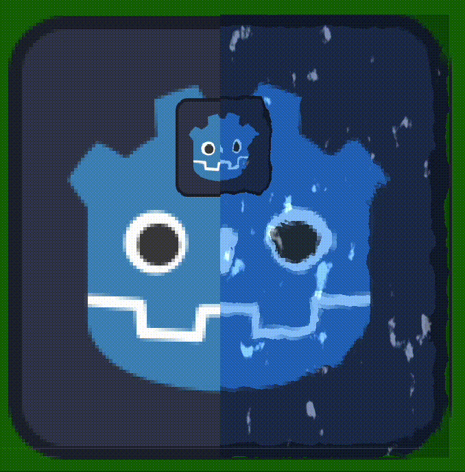

# Water-shader2d

This 2D water shader was done following a YouTube video by PlayWithFurcifer.

[YouTube video](https://www.youtube.com/watch?v=eU-F-xuEo7s)

All credit goes to Fucifer: https://x.com/TweetFurcifer

> Some minor hacks applied post v4 update

> Added additional comments so this can be implemented by beginners (incl. me)

> Example scene included

# Instructions
You will find these instructions next to the shader code along with additional (hopefully useful) comments.

Please note I'm a beginner with shaders, so I am most probably messing things up. Any comments and tips are super welcome.

1. First create a new sprite. Any sprite will do. Dragging a default "icon.svg" is
not a must but strongly advised.
2. Select the sprite. Under Inspector -> Material add a New ShaderMaterial;
3. Select the material (the white BALL). Shader -> New Shader, Options:
Type: Shader; Mode: Canvas Item, Template: Empty; Path: whatever-you-want
4. Paste this code in the shader editor
5. Under shader parameters add noise and noise2,
make sure to set them to seamless. I use FastNoise, you can choose hichever
noise you wish. Experimentation is part of the fun :)
